### Hey, I'm Cameron

Principal AI Security Engineer at a major US retailer. I build secure-by-design AI systems at scale.

  

**Tech Stack**

**Currently building:**
- MCP servers and agent infrastructure
- GitOps tooling for home labs and bare metal
- Obsidian integrations and PKM automation

**Pinned:**
<!-- PINS:START -->
<!-- generated weekly — do not edit by hand -->
- [spec-compare](https://github.com/cameronsjo/spec-compare) — Research comparing 6 spec-driven development tools (Spec-Kit, Spec Kitty, BMad, OpenSpec, Kiro, Tessl) with git worktree analysis and decision frameworks ★ 45
- [bosun](https://github.com/cameronsjo/bosun) — GitOps for Docker Compose on bare metal
- [cadence-hooks](https://github.com/cameronsjo/cadence-hooks) — Compiled Claude Code hooks — single binary for cadence, git-guardrails, rules, and obsidian plugins ★ 2
- [artificer](https://github.com/cameronsjo/artificer) — Artificer — Cameron's AuDHD-friendly, dark-first design system for tools, dashboards, and terminals. MIT, Cameron-first. ★ 1
- [agent-pool](https://github.com/cameronsjo/agent-pool) — Process supervisor managing headless Claude Code expert sessions with mixture-of-experts routing, externalized state, and filesystem-based coordination
<!-- PINS:END -->

I learn by building. You won't see me in your feed much, but you'll see the repos.
